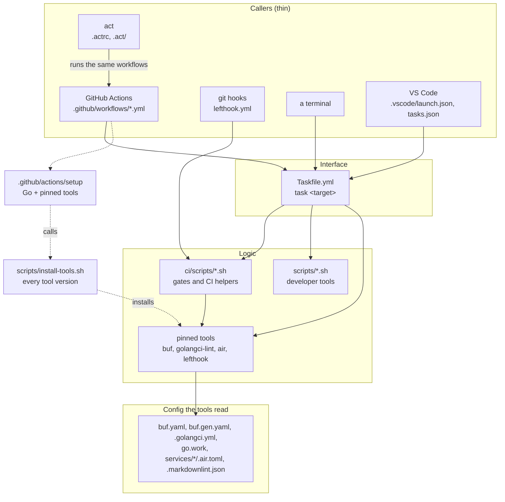
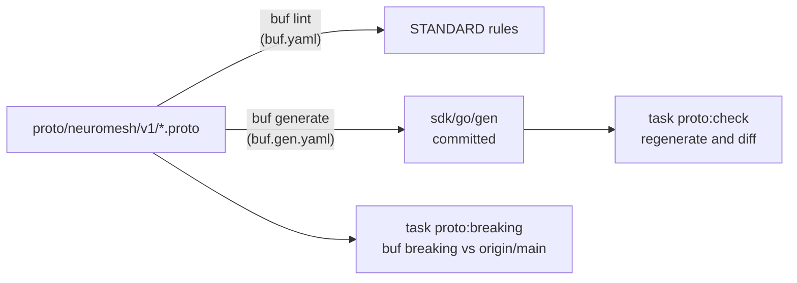

# How the tooling works

This is the map of the repository's tooling: what each piece is, how the pieces call each other, and what to change when adding something. For day-to-day commands, read [Dev loop](dev-loop.md); for running the workflows with act, read [Local CI](local-ci.md).

## The one rule

**Every command that matters is a Taskfile target, and everything else calls the Taskfile.** A GitHub workflow step, a git hook, an act run and a terminal all end up in the same `task` target, which runs the same script. So "it passed locally" and "it passed in CI" mean the same thing, and a gate is written once.

Workflows never contain logic beyond checkout, setup and `task ci:<job>`. The hooks call `ci/scripts` directly (a hook must stay fast and needs no Task features), but they call the same scripts CI does.

## Where versions come from

Each version lives in exactly one place, and everything else reads it from there.

| What | Source of truth | Read by |
| --- | --- | --- |
| Tool versions (task, buf, protoc-gen-go, protoc-gen-go-grpc, golangci-lint, air, lefthook) | `scripts/install-tools.sh` | `task tools:install`, the CI setup action, `task doctor` (`--versions`) |
| Go language minimum | `go` line in `go.work` and each `go.mod` (1.26.3) | gopls, the Go command |
| Go that builds | `toolchain go1.26.8` in `go.work`; `FROM golang:1.26.8` in both Dockerfiles | the Go command (downloads it), setup-go in CI, `task go:test:docker` |
| Node and pnpm | `engines.node` and `packageManager` in `package.json` | pnpm/action-setup, `task doctor` |
| GitHub Actions | the `uses:` lines in `.github/` | GitHub, act |
| CI runner image | `runs-on: ubuntu-24.04`; `.actrc` maps it for act | GitHub, act |
| Application version | `version` in `package.json`, equal to the newest `CHANGELOG.md` entry | `ci/scripts/version.sh`, image tags and labels, job summaries |
| Shared Go dependency versions (grpc, protobuf, yaml) | the workspace build list | `task deps:check` fails when modules disagree |

Why `go` and `toolchain` differ: the `go` line is a hard minimum, and gopls runs whatever Go is installed without switching. Keeping it at what the code needs lets the editor work on an older install, while `toolchain` makes every build use 1.26.8 (buf needs 1.26.7 or newer). setup-go reads the `toolchain` line.

## The pieces

### Taskfile

`Taskfile.yml` at the root, plus one per service (`services/<svc>/Taskfile.yml`, included as `runtime:*` and `gateway:*`). `task --list` shows every target with a description. Groups:

| Group | Targets |
| --- | --- |
| Setup | `tools:install`, `doctor`, `hooks:install` |
| Dev loop | `dev`, `call:route`, `call:health`, `call:runtime`, `certs:dev`, `certs:trust`, `certs:untrust` |
| Go | `deps:check`, `deps:tidy`, `go:build`, `go:vet`, `go:lint`, `go:fmt`, `go:test`, `go:test:docker`, `test:unit`, `test:golden`, `cover:html` |
| Proto | `proto:gen`, `proto:lint`, `proto:check`, `proto:breaking` |
| Images | `images:build`, `images:smoke` |
| Docs and releases | `adr:new`, `rfc:new`, `release:next` |
| CI jobs | `ci:version`, `ci:go`, `ci:proto`, `ci:web`, `ci:docs`, `ci:images`, and `ci` for all of them |
| Single gates | `ci:line-endings`, `ci:docs-links`, `ci:changelog`, `ci:version-gate`, `ci:summary`, `ci:changelog-summary` |

Task runs commands through its own embedded shell, which handles simple pipelines but not every `sed` expression. Anything more than a one-liner goes in a script, and the target calls `bash <script>`. On Windows, run `task` from Git Bash: PowerShell may resolve `bash` to WSL.

### Scripts

`ci/scripts/` holds gates and CI helpers; `scripts/` holds developer tools. Every script starts with a comment saying what it checks and why.

| Script | Does |
| --- | --- |
| `ci/scripts/lib.sh` | Shared helpers, sourced by the others: repository root, the module list from `go.work` |
| `ci/scripts/go-workspace.sh` | `build`, `vet`, `lint`, `fmt`, `test`, `unit` across every module in `go.work` (the root has no module, so `./...` does not work there) |
| `ci/scripts/deps-check.sh` | Every `go.mod` is in `go.work`, each module is tidy and builds with `GOWORK=off`, `go work sync` changes nothing. `--fix` applies the result |
| `ci/scripts/proto-check.sh` | `buf lint`, then generates into a temp directory and diffs it with the committed `sdk/go/gen` |
| `ci/scripts/proto-breaking.sh` | `buf breaking` against `origin/main`; skips while main has no `buf.yaml` |
| `ci/scripts/check-line-endings.sh` | No tracked file has CRLF on disk. act copies the working tree, not the commit |
| `ci/scripts/check-doc-links.sh` | Every relative Markdown link resolves and none leaves the repository |
| `ci/scripts/changelog-integrity.sh` | `[Unreleased]` first, heading format, unique, descending and gap-free versions, no duplicated title, `package.json` equals the newest entry |
| `ci/scripts/version-gate.sh` | A change to code, contracts, infrastructure or CI adds a new version, compared with the merge base of `origin/main` |
| `ci/scripts/version-control.sh` | The version control job: runs the two checks above, then writes the version, status, commit, Go version and that version's changelog entry to the job summary |
| `ci/scripts/version.sh`, `version-summary.sh`, `changelog-summary.sh` | Print the version; the version header; the latest changelog updates |
| `ci/scripts/images-smoke.sh` | Runs both images with fresh certificates and checks HTTPS, mutual TLS, the non-root user and the version label |
| `scripts/install-tools.sh` | Installs the pinned tools with `go install`; `--versions` prints the pins |
| `scripts/doctor.sh` | Checks a machine: Go, pins, Node, pnpm, Docker, act, certificates, hooks, `origin/main`, line endings |
| `scripts/test-in-docker.sh` | The Go tests in a Linux container with `-race`, for machines without cgo |
| `scripts/release-next.sh`, `new-doc.sh` | The next changelog version plus `package.json`; the next numbered ADR or RFC |
| `scripts/windows-trust-ca.ps1` | Adds or removes the dev CA in the current Windows user's trust store |

### Proto and buf

- `buf.yaml` declares the module (`proto/`), lint with the STANDARD rules, and breaking-change detection with the FILE rules. The one exception lists `runtime.proto`'s pre-buf message names, so new files get no exceptions.
- `buf.gen.yaml` runs the local `protoc-gen-go` and `protoc-gen-go-grpc`, whose versions come from `install-tools.sh`. That pin is what makes the committed output reproducible.
- Generated code is committed so the Dockerfiles need no protoc and a module fetched on its own compiles. The price is possible drift, which `proto:check` catches.

### Go workspace

- `go.work` lists every module. Each module also resolves its siblings through `replace` directives in its own `go.mod`, so it builds with `GOWORK=off`, which is how the Dockerfiles build.
- `.golangci.yml` runs the linters (including `forbidigo` against the `log` package outside `tools/`) and the formatters (gofumpt, goimports). `task go:lint` fails on unformatted code; `task go:fmt` fixes it.
- Tests measure coverage across modules (`-coverpkg`), so `test/integration` counts toward the server packages it exercises. The merged total prints last.

### Certificates

`packages/utils/certgen` mints a throwaway CA and per-service certificates for tests and for runs outside a cluster (`task certs:dev`, into the gitignored `certs/dev`). On a cluster, cert-manager issues them. Both write the same files per service, `tls.crt`, `tls.key` and `ca.crt`, so configs are identical, and paths in a config resolve against the config file's own directory.

### Hooks

`lefthook.yml`, installed by `task hooks:install`:

- **pre-commit** (in parallel, each only when matching files are staged): line endings, Go formatting (`golangci-lint fmt --diff`), doc links, changelog integrity, buf lint.
- **pre-push**: the version gate and the unit tests.

`git commit --no-verify` skips them; CI runs the full versions regardless.

### CI

| Workflow | Jobs | Notes |
| --- | --- | --- |
| `ci.yml` | `version`, then `go`, `proto`, `web` | The three wait for version control. `proto` and `version` fetch full history for the `origin/main` comparisons |
| `docs.yml` | `docs` | Line endings and links; the summary shows the latest changelog updates |
| `images.yml` | `images` | Builds both images tagged and labelled with the version, runs the smoke test; the summary shows the version and an images table |

`.github/actions/setup` is the shared setup: Go from `go.work`, then `install-tools.sh` for whichever tools the job needs. act runs these workflows unchanged; see [Local CI](local-ci.md).

## Adding things

**A tool.** Add it to `PINS` and `ORDER` in `scripts/install-tools.sh`, add its version check to `scripts/doctor.sh`, pass its name in the `tools:` input of any workflow job that needs it, and use it through a Taskfile target. It then installs the same way everywhere.

**A Go module.** Create it with a `go.mod` whose `go` line matches the others, add `replace` directives for every sibling module in its graph, add it to `go.work`, then run `task deps:tidy`. `task deps:check` fails if a `go.mod` exists that `go.work` does not list. Build, vet, lint and test pick it up from `go.work` with no other change.

**A service.** A module as above, plus `cmd/server`, `pkg/server` (so tests can boot it), `configs/config.yaml` and `config.container.yaml` in the cert-manager layout, a `Dockerfile` modelled on the existing two (distroless static, `nonroot`, `VERSION` build argument), a `Taskfile.yml` included from the root, and a `.air.toml` plus `dev:*` targets if it belongs in `task dev`.

**A CI gate.** Write the script in `ci/scripts/` with a header comment saying what it catches, add a `ci:<name>` target, call it from the right `ci:<job>` target (not from the workflow), and add it to `lefthook.yml` if it is fast enough for a commit. Prove it fails: break the thing it guards once, watch it go red, then restore.

**A proto.** Add the file under `proto/neuromesh/v1/`, run `task proto:gen`, and commit the generated code with it. It gets the STANDARD lint rules with no exceptions.

**A release.** Every change to code, contracts, infrastructure or CI needs a version: `task release:next -- <major|minor|patch> "Title"`, then write the entry. Documentation-only changes do not.
